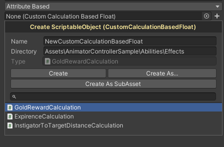
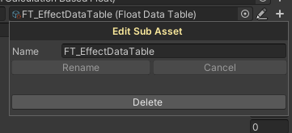

# About

This package enhances the scriptable object property in the editor by adding two small buttons, one for creating scriptable object
with a easy-to-use popup window which allows sub-asset creation and the second one for editing sub assets as unity doesn't provide a
way to delete and to rename them.

# Installing

To install this package, follow the instructions in [Installing from a Git URL](https://docs.unity3d.com/Manual/upm-ui-giturl.html).

# How to use

After the package has been added to you project, a button can be spotted beside any scriptable object property, by clicking it a popup
windows is displayed then you can define the asset name, define where it should be saved, select the type for the new object from a
list of valid types for this property and finally select how to create it, if you want to create it just as you defined (**Create**)
or open a dialog so you can provide a path through a form as you normally do with files in your computer (**Create As...**)
or create this file as sub-asset of the owning object (**Create As SubAsset**).

If you create a sub asset, now the creating button has a friend, the editing button, which is represented by a pencil ✏️, because
that's the way people represent editing, I guess. The editing button as well as the creating button display a popup window, but a
simple one where you can rename the asset and delete it.

# Motivation

I really like to use [strategy pattern](https://en.wikipedia.org/wiki/strategy_pattern) but it's a little bit complicated to do it in
unity if you encapsulate strategy within scriptable objects, because every class requires a menu item for create it and when you're
setting multiples properties it's slow and boring to do it, so why not a custom editor tool for help us?

Not only did the creation process motivate me, but also the fact that Unity doesn't have any built-in features to allow us to create
sub-assets increased my motivation to create this package.
